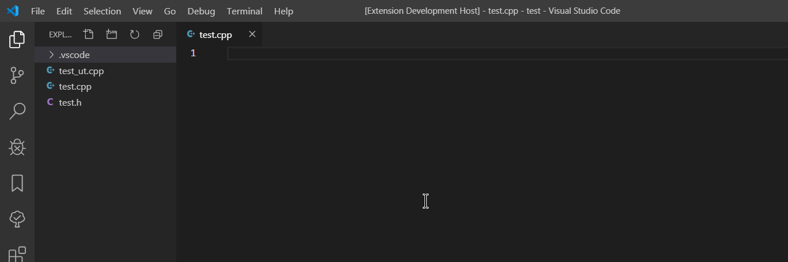

# Introduction
This extension enables you quickly switch between interested files. Press `Ctrl+Alt+S` to switch to another file from quick pick.



# Setting
The following setting enables quick switch among .cpp, .h and _ut.cpp files.

```json
"quickSwitch.rules": [
    {
        "pattern": "(.+?)(_ut\\.cpp|\\.cpp|\\.h)",
        "list": [
            "$1.cpp",
            "$1.h",
            "$1_ut.cpp"
        ]
    }
]
```
1. pattern: a regular expression to match with the current file path. The first rule that matches will be used for quick switch.
1. list: an ordered list of files for quick switch. Use $n to reference the capturing groups defined in pattern.